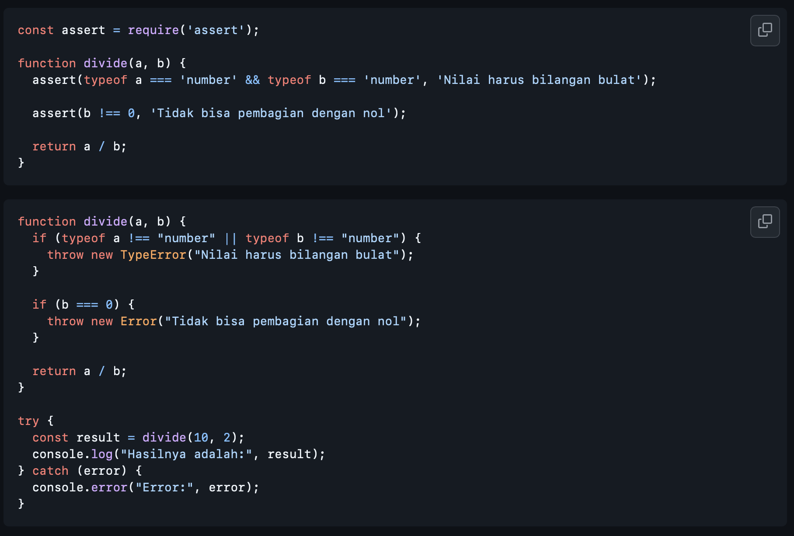

# Tugas Pendahuluan : Design by Contract dan Defensive Programming

Kevin Kendra adi sebastian

103122400067

SE-08-02

Dosen Pengampu : Yudha Islami Sulistya

Asisten Praktikum : Ardiansyah Muhammad Pradana Farawowan, dan Hamid Khaeruman 

## Soal

## Jawaban

Dalam konteks pemrograman, asersi (assertion) dan eksepsi (exception) memiliki tujuan yang berbeda meskipun sekilas tampak mirip karena sama-sama digunakan untuk menangani kondisi error. Pemilihan antara keduanya sebaiknya didasarkan pada tujuan penggunaan dan siapa yang bertanggung jawab terhadap kesalahan tersebut.

Asersi digunakan untuk memverifikasi asumsi internal dalam kode. Artinya, asersi dipakai ketika kita yakin bahwa kondisi tertentu seharusnya selalu benar jika program berjalan dengan benar. Contohnya, memastikan bahwa parameter fungsi sudah divalidasi sebelumnya atau memastikan state internal tidak rusak. Jika asersi gagal, itu menandakan adanya bug dalam kode, bukan kesalahan dari pengguna. Oleh karena itu, asersi biasanya digunakan pada tahap pengembangan (development) dan bisa dinonaktifkan di production. Dalam contoh pertama, penggunaan assert untuk memastikan tipe data dan pembagi tidak nol sebenarnya kurang tepat jika fungsi tersebut menerima input dari luar (user input), karena kondisi tersebut bisa saja valid secara logika program tetapi salah dari sisi pengguna.

Sebaliknya, eksepsi digunakan untuk menangani kesalahan yang mungkin terjadi saat runtime dan berasal dari faktor eksternal, seperti input pengguna yang tidak valid atau kondisi tak terduga (misalnya pembagian dengan nol). Dengan menggunakan throw, kita memberikan kesempatan kepada program untuk menangani error tersebut secara elegan, misalnya dengan menampilkan pesan yang ramah atau melakukan fallback. Pada contoh kedua, penggunaan TypeError dan Error lebih tepat karena fungsi divide kemungkinan besar akan digunakan secara umum dan menerima berbagai input.

Kesimpulannya, kita tidak seharusnya memilih sepenuhnya asersi atau sepenuhnya eksepsi, melainkan mengombinasikan keduanya sesuai kebutuhan. Gunakan asersi untuk mendeteksi bug internal dan menjaga konsistensi program, sedangkan gunakan eksepsi untuk menangani kesalahan yang dapat terjadi secara normal selama eksekusi program, terutama yang melibatkan interaksi dengan pengguna atau sistem eksternal. Pendekatan ini menghasilkan kode yang lebih aman, jelas, dan mudah dipelihara.