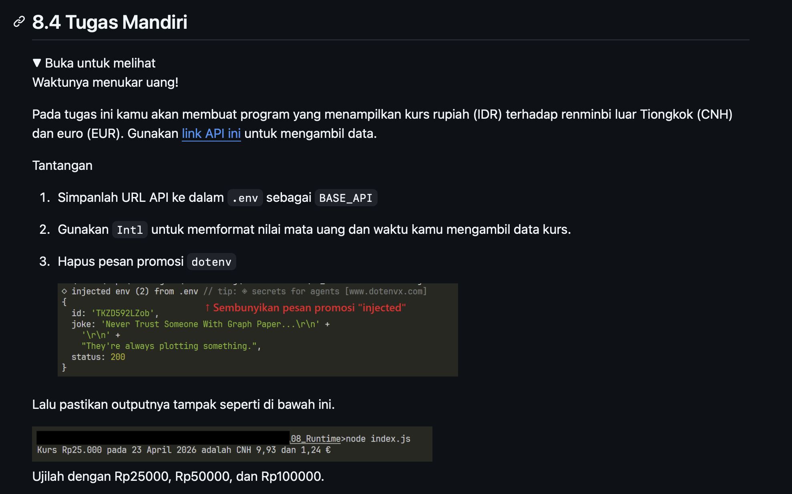
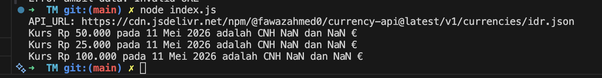

# Tugas Mandiri : Runtime Configuration dan Internationalization

Kevin Kendra Adi Sebastian

103122400067

SE-08-02

Dosen Pengampu : Yudha Islami Sulistya

Asisten Praktikum : Ardiansyah Muhammad Pradana Farawowan, dan Hamid Khaeruman 

## Soal

## Sumber Kode

Tersedia di [index.js](index.js)

## Output

## Deskripsi

Pada praktikum ini dibuat sebuah program JavaScript berbasis Node.js yang berfungsi untuk menampilkan nilai tukar mata uang rupiah (IDR) terhadap Chinese Yuan Offshore (CNH) dan Euro (EUR) secara real-time menggunakan API kurs mata uang. Program memanfaatkan library axios untuk mengambil data dari API dan dotenv untuk menyimpan URL API ke dalam file .env agar lebih aman dan mudah dikelola.

Selain itu, program menggunakan fitur Intl pada JavaScript untuk memformat tampilan mata uang dan tanggal sesuai standar lokal Indonesia. Output program menampilkan hasil konversi sejumlah nominal rupiah ke mata uang CNH dan EUR beserta tanggal pengambilan data kurs.

Dalam implementasinya, pesan promosi bawaan dari dotenv juga disembunyikan menggunakan konfigurasi { quiet: true } agar tampilan terminal menjadi lebih rapi. Program kemudian diuji menggunakan beberapa nominal rupiah, yaitu Rp25.000, Rp50.000, dan Rp100.000 untuk memastikan proses konversi berjalan dengan baik.

Tujuan dari praktikum ini adalah:
1. Memahami penggunaan API pada Node.js.
2. Mempelajari penggunaan package axios dan dotenv.
3. Memahami penggunaan asynchronous programming dengan async/await.
4. Menggunakan Intl.NumberFormat dan Intl.DateTimeFormat untuk formatting data.
5. Mengimplementasikan pengelolaan environment variable menggunakan file .env.