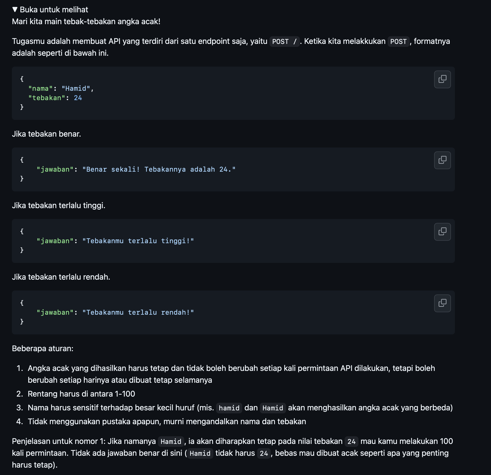

# Tugas Mandiri : API Design dan Construction Using Swagger

Kevin Kendra Adi Sebastian

103122400067

SE-08-02

Dosen Pengampu : Yudha Islami Sulistya

Asisten Praktikum : Ardiansyah Muhammad Pradana Farawowan, dan Hamid Khaeruman 

## Soal

## Sumber Kode

Tersedia di [index.js](index.js) dan [swagger.js](swagger.js)

## Output

v

## Deskripsi

Tentu, ini draf deskripsi untuk tugas **API Tebak Angka (TM)** yang sudah disesuaikan dengan bahasa formal dan sangat cocok untuk dimasukkan ke dalam dokumen laporanmu:

### Deskripsi Tugas / Proyek

Tugas ini bertujuan untuk merancang dan mengimplementasikan RESTful API interaktif berbasis **Node.js** dan **Express.js** yang menyimulasikan sebuah permainan tebak angka. Fokus utama dari proyek ini adalah pengolahan data masukan dari pengguna (*request body*) serta penyediaan dokumentasi API yang standar dan profesional menggunakan **Swagger** (*OpenAPI Specification*).

**Fitur dan Fungsionalitas Utama:**

* **Logika Permainan Berbasis ASCII:** Mengimplementasikan *endpoint* dengan metode `POST` (`/tebak`) yang menerima input berupa `nama` pemain dan angka `tebakan`. Sistem akan secara dinamis menghasilkan "angka rahasia" (antara 1-100) yang dikalkulasi berdasarkan total nilai kode ASCII dari karakter nama pemain tersebut.
* **Validasi dan Umpan Balik Kondisional:** Sistem memproses tebakan pengguna dan memberikan respons balik yang spesifik, yaitu memberitahu apakah angka yang ditebak "terlalu rendah", "terlalu tinggi", atau "benar" sesuai dengan angka rahasia yang telah dikalkulasi.
* **Dokumentasi API Interaktif (Swagger UI):** Menyediakan halaman antarmuka visual terintegrasi pada *route* `/docs`. Antarmuka ini memaparkan detail skema *request body* yang dibutuhkan, serta memungkinkan pengguna untuk melakukan pengujian pengiriman data (JSON) secara langsung dari peramban tanpa memerlukan perangkat lunak tambahan.

Deskripsi ini menyoroti logika teknis (`charCodeAt`, perhitungan *modulo*) dan integrasi Swagger-nya, sehingga laporanmu akan terlihat lebih berbobot secara akademis!