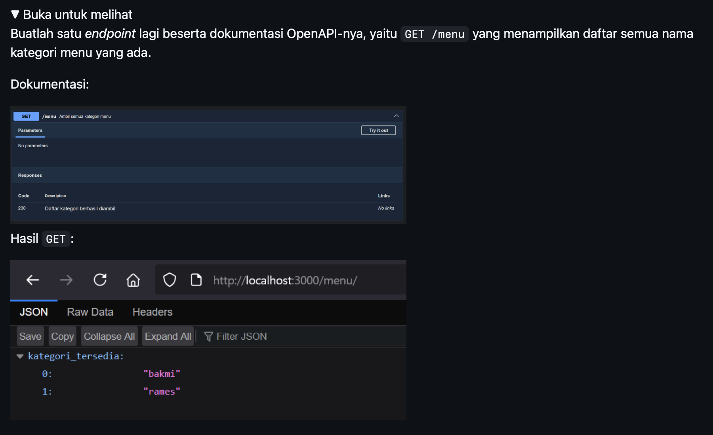
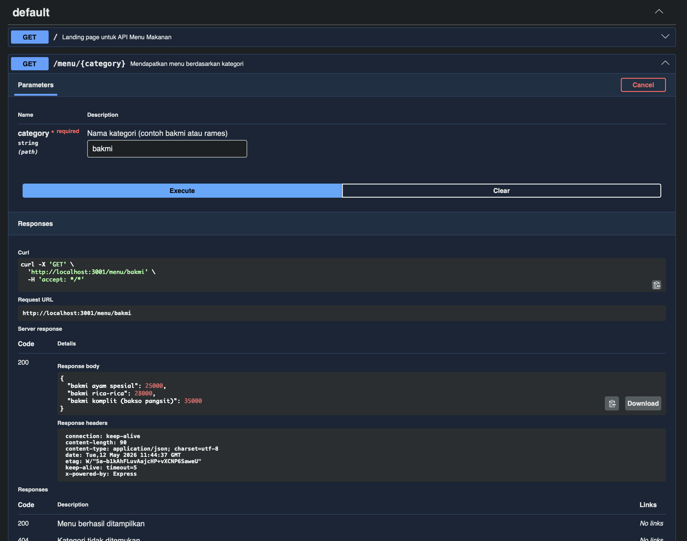

# Tugas Pendahuluan : API Design dan Construction Using Swagger

Kevin Kendra Adi Sebastian

103122400067

SE-08-02

Dosen Pengampu : Yudha Islami Sulistya

Asisten Praktikum : Ardiansyah Muhammad Pradana Farawowan, dan Hamid Khaeruman 

## Soal

## Sumber Kode
Tersedia di [index.js](index.js) dan [swagger.js](swagger.js)

## Output

## Deskripsi
Tentu, berikut adalah draf deskripsi singkat yang profesional dan terstruktur. Kamu bisa langsung menyalinnya atau menyesuaikannya dengan format laporanmu:

### Deskripsi Tugas / Proyek

Tugas ini bertujuan untuk merancang dan membangun RESTful API sederhana menggunakan **Node.js** dan kerangka kerja **Express.js** yang berfungsi untuk menyajikan data menu makanan. Fokus utama dari pengembangan ini adalah penerapan dokumentasi API yang standar dan interaktif menggunakan **Swagger** (melalui integrasi *library* `swagger-jsdoc` dan `swagger-ui-express`).

**Fitur dan Fungsionalitas Utama:**

* **Routing & Parameter Dinamis:** Mengimplementasikan *endpoint* (`/menu/:category`) untuk mengambil dan menampilkan data menu makanan beserta harganya secara spesifik berdasarkan kategori (contoh: bakmi dan rames).
* **Dokumentasi Interaktif (Swagger UI):** Menyediakan halaman antarmuka visual pada *route* `/docs` yang dibangun berdasarkan spesifikasi OpenAPI. Halaman ini memungkinkan pengguna dan pengembang lain untuk membaca detail *endpoint*, melihat struktur data (*responses*), serta melakukan pengujian API secara langsung dari peramban (*browser*).
* **Penanganan *Error* Sederhana:** Dilengkapi dengan respons status `404 Not Found` apabila pengguna mencoba mengakses kategori menu yang tidak tersedia di dalam sistem.

---

**Tips untuk Laporan:** Deskripsi ini sangat cocok diletakkan pada bagian **Pendahuluan**, **Tujuan Praktikum**, atau **Deskripsi Sistem** di dalam dokumen laporanmu.
