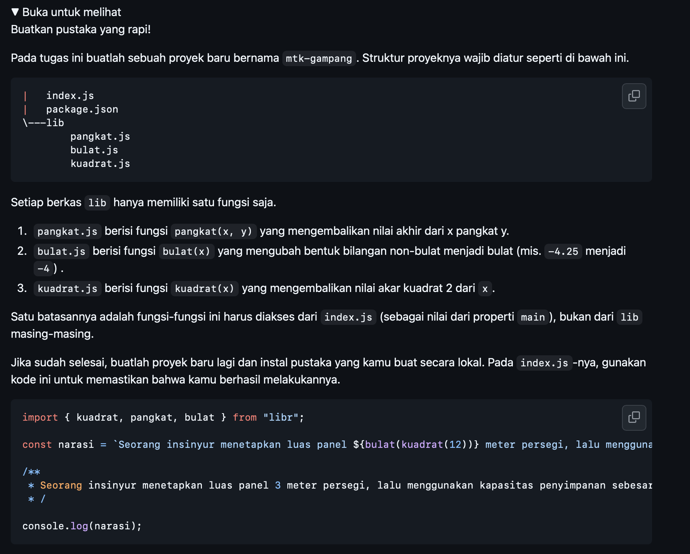
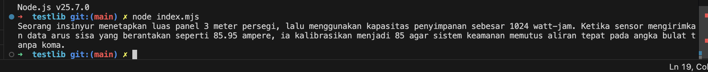

# Tugas Mandiri : Library Construction

Kevin Kendra Adi Sebastian

103122400067

SE-08-02

Dosen Pengampu : Yudha Islami Sulistya

Asisten Praktikum : Ardiansyah Muhammad Pradana Farawowan, dan Hamid Khaeruman 

## Soal

## Sumber Kode

Tersedia di [index.js](index.mjs)

## Output

## Deskripsi

Berikut adalah draf deskripsi tugas untuk proyek pembuatan *library* matematika tersebut. Deskripsi ini disusun dengan bahasa formal dan akademis, sehingga sangat cocok untuk dimasukkan ke dalam dokumen laporan praktikum atau proyek akhirmu:

### Deskripsi Tugas / Proyek

Tugas ini bertujuan untuk merancang dan membangun sebuah pustaka (*library*) utilitas matematika sederhana menggunakan **Node.js**. Fokus utama dari proyek ini adalah pemahaman dan penerapan arsitektur perangkat lunak yang modular dengan memanfaatkan standar **ES Modules (ESM)** pada JavaScript untuk pengelolaan siklus ekspor (`export`) dan impor (`import`) antar berkas.

**Fitur dan Fungsionalitas Utama:**

* **Arsitektur Modular (Separation of Concerns):** Logika matematika dipecah menjadi modul-modul independen yang disimpan di dalam direktori `lib/`. Modul-modul tersebut mencakup fungsi `kuadrat` (menggunakan `Math.sqrt`), `pangkat` (eksponensial), dan `bulat` (pembulatan ke bawah menggunakan `Math.floor`).
* **Sentralisasi Akses (Entry Point):** Mengimplementasikan satu berkas utama (`index.mjs`) yang berfungsi sebagai agregator. Berkas ini bertugas mengimpor seluruh fungsi dari direktori `lib/` dan mengekspornya kembali secara kolektif, sehingga mempermudah proses pemanggilan *library* oleh pihak eksternal.
* **Sistem Eksekusi dan Pengujian (Testing):** Pustaka yang telah dibangun kemudian diimpor ke dalam lingkungan pengujian terpisah (direktori `testlib`). Modul-modul tersebut diimplementasikan ke dalam sebuah studi kasus berbentuk narasi dinamis menggunakan *Template Literals*, yang secara langsung memvalidasi keakuratan logika perhitungan matematika yang telah dibuat.