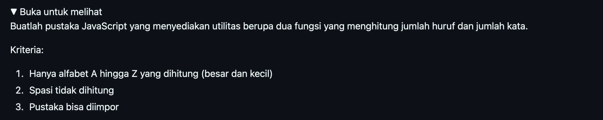
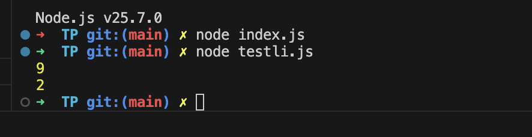

# Tugas Pendahuluan : Library Construction

Kevin Kendra Adi Sebastian

103122400067

SE-08-02

Dosen Pengampu : Yudha Islami Sulistya

Asisten Praktikum : Ardiansyah Muhammad Pradana Farawowan, dan Hamid Khaeruman 

## Soal

## Sumber Kode
Tersedia di [index.js](index.js) dan [testlib.js](testli.js)

## Output

## Deskripsi
Tentu, ini adalah draf deskripsi tugas yang disusun dengan bahasa profesional dan terstruktur, sangat cocok untuk disalin langsung ke dalam dokumen laporanmu. Deskripsi ini menyoroti aspek pembuatan *library* (pustaka) dan penggunaan ES Modules.

### Deskripsi Tugas / Proyek

Tugas ini bertujuan untuk merancang dan membangun sebuah pustaka (library) utilitas sederhana berbasis JavaScript yang berfokus pada manipulasi dan analisis teks (*string*). Proyek ini difokuskan pada implementasi arsitektur kode yang modular dengan menerapkan standar **ES Modules (ESM)** untuk mengelola siklus ekspor (`export`) dan impor (`import`) fungsi antar berkas.

**Fitur dan Fungsionalitas Utama:**

* **Penghitung Huruf Presisi (`hitungHuruf`):** Mengimplementasikan *Regular Expression* (Regex) `/[a-zA-Z]/g` untuk memindai dan menghitung jumlah karakter alfabet secara spesifik. Logika ini dirancang untuk secara otomatis mengabaikan karakter non-huruf seperti angka, spasi, dan tanda baca.
* **Penghitung Kata Dinamis (`hitungKata`):** Menerapkan metode manipulasi teks menggunakan fungsi `trim()` dan `split(/\s+/)`. Pendekatan ini memastikan akurasi perhitungan kata meskipun terdapat spasi ganda (multispasi) di antara kata atau masukan teks yang kosong.
* **Anotasi Tipe dengan JSDoc:** Fungsi-fungsi utama didokumentasikan menggunakan standar **JSDoc** (`@param`, `@returns`) untuk mendefinisikan tipe parameter dan nilai kembalian, sehingga meningkatkan keterbacaan kode (*code readability*) dan mempermudah pemeliharaan (*maintenance*).
* **Pengujian Fungsionalitas Mandiri:** Menerapkan prinsip pemisahan perhatian (*separation of concerns*) di mana logika utama pustaka (di `index.js`) diisolasi dari skrip pengujian (di `tesli.js`) untuk memvalidasi keluaran dari masing-masing fungsi secara independen.